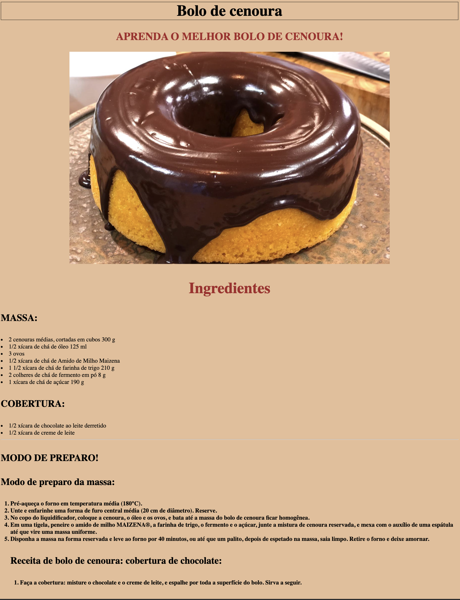

# Receita-2024

---
## Sobre
Site para divulgar receita de bolo,
O intuito desse projeto é colocar em prática o conhecimento adquirido sobre as linguagem de marcação, HTML, CSS, Markdown, no curso Técnico de Desenvolvimento de sistemas [SENAI Jandira](https://sp.senai.br/unidade/jandira/)

---
## Tecnologias utilizadas
- HTML
- CSS
- Markdown
- Git

---
# Autor
- [Eduardo Couto github](https://github.com/dashboard)
- [Eduardo Couto linkedin](https://www.linkedin.com/feed/?trk=onboarding-landing)
